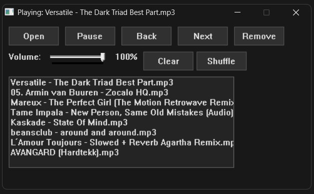

# MP3X

MP3X is a lightweight and resource-efficient MP3 player optimised for minimal CPU and RAM usage, making it ideal for gaming and other performance-sensitive environments.

## Note

This project is developed primarily for personal daily use; however, it is available for anyone interested in using it. 

Estimated Resource Usage: 
1 song in queue: 11.8MB RAM 
100 songs in queue: 18.9MB RAM 

## Installation

Download the following files from the [Releases](https://github.com/usafdev/mp3x/releases) page or directly from this repository:

- `player.exe`
- `libportaudio.dll`
- `libmpg123-0.dll`

### Setup

Place all downloaded files in the **same directory**.

### Running the Player

Launch the `player.exe` application.
